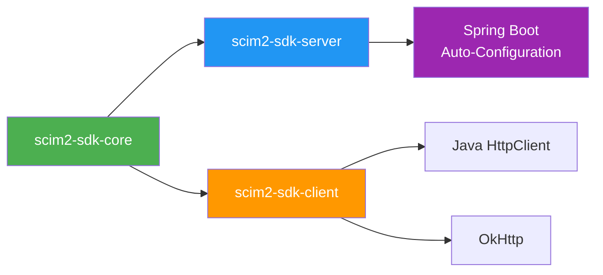

[](https://github.com/marcosbarbero/scim2-sdk-jvm/actions/workflows/ci.yml)
[](https://codecov.io/gh/marcosbarbero/scim2-sdk-jvm)
[](https://central.sonatype.com/search?q=com.marcosbarbero.scim2-sdk)
[](LICENSE)
[](https://kotlinlang.org)

# SCIM 2.0 SDK for JVM

A modern, Kotlin-first SCIM 2.0 (RFC 7643/7644) SDK for the JVM with full Java interop.

## Features

- **Complete RFC compliance**: All SCIM 2.0 operations (CRUD, search, bulk, patch, discovery)
- **Kotlin-first with Java interop**: Kotlin DSLs, extension functions, coroutines, plus @Jvm annotations for Java users
- **Hexagonal architecture**: Framework-agnostic core, pluggable persistence and identity
- **Spring Boot starter**: Auto-configuration with sensible defaults
- **Works without Spring**: Use with any JVM HTTP framework
- **OOTB persistence**: JPA adapter with reference schemas for PostgreSQL, MySQL, Oracle, MSSQL, H2
- **Observability**: Metrics (Micrometer), tracing, structured logging, event system
- **Type-safe client**: Fluent API with Kotlin DSLs for filters, patches, searches
- **RFC 9457 ProblemDetail**: Content-negotiated error responses
- **Extensible**: SPI for serialization, HTTP transport, identity, authorization, events

## Architecture

For detailed architecture diagrams (module dependencies, request flow, authentication, outbox pattern), see [docs/architecture.md](docs/architecture.md).



## Quick Start

### With Spring Boot

Add the starter dependency:

```xml
<dependency>
    <groupId>com.marcosbarbero</groupId>
    <artifactId>scim2-sdk-spring-boot-starter</artifactId>
    <version>${scim2-sdk.version}</version>
</dependency>
```

Configure in `application.yml`:

```yaml
scim:
  base-path: /scim/v2
  persistence:
    enabled: true  # enables JPA-backed storage
  bulk:
    enabled: true
  filter:
    enabled: true
```

That's it! The starter auto-configures:
- SCIM endpoints at `/scim/v2/*` (Users, Groups, Schemas, ResourceTypes, ServiceProviderConfig, Bulk)
- JPA persistence with H2/PostgreSQL/MySQL/Oracle/MSSQL
- Jackson serialization with SCIM module
- Micrometer metrics (when on classpath)
- RFC 9457 ProblemDetail error responses

To provide your own `ResourceHandler`:

```kotlin
@Component
class CustomUserHandler(private val userService: UserService) : ResourceHandler<User> {
    override val resourceType = User::class.java
    override val endpoint = "/Users"

    override fun create(resource: User, context: ScimRequestContext) = userService.create(resource)
    override fun get(id: ResourceId, context: ScimRequestContext) = userService.findById(id.value)
    // ... other methods
}
```

#### Java equivalent

```java
@Component
public class CustomUserHandler implements ResourceHandler<User> {
    private final UserService userService;

    public CustomUserHandler(UserService userService) {
        this.userService = userService;
    }

    @Override public Class<User> getResourceType() { return User.class; }
    @Override public String getEndpoint() { return "/Users"; }

    @Override
    public User create(User resource, ScimRequestContext context) {
        return userService.create(resource);
    }

    @Override
    public User get(ResourceId id, ScimRequestContext context) {
        return userService.findById(id.getValue());
    }
    // ... other methods
}
```

See [sample-server-java](scim2-sdk-samples/sample-server-java/) for a complete Java example.

### Without Spring Boot

```kotlin
fun main() {
    // Create handlers
    val userHandler = InMemoryResourceHandler(User::class.java, "/Users", userRepository)
    val groupHandler = InMemoryResourceHandler(Group::class.java, "/Groups", groupRepository)

    // Create infrastructure
    val schemaRegistry = SchemaRegistry().apply {
        register(User::class)
        register(Group::class)
    }
    val serializer = JacksonScimSerializer()
    val config = ScimServerConfig(basePath = "/scim/v2")
    val discoveryService = DiscoveryService(listOf(userHandler, groupHandler), schemaRegistry, config)

    // Create dispatcher
    val dispatcher = ScimEndpointDispatcher(
        handlers = listOf(userHandler, groupHandler),
        discoveryService = discoveryService,
        config = config,
        serializer = serializer,
        bulkHandler = null,
        meHandler = null
    )

    // Use with any HTTP server - dispatch(ScimHttpRequest) returns ScimHttpResponse
    val response = dispatcher.dispatch(scimRequest)
}
```

See [sample-server-plain](scim2-sdk-samples/sample-server-plain/) for a complete example using JDK's built-in HTTP server.

### Client Usage

```kotlin
// Create client
val client = ScimClientBuilder()
    .baseUrl("https://scim.example.com/scim/v2")
    .transport(HttpClientTransport())
    .serializer(JacksonScimSerializer())
    .authentication(BearerTokenAuthentication("your-token"))
    .build()

// Type-safe operations (recommended)
val response = client.createUser(user)
val user = client.getUser(id).value
val results = client.searchUsers("userName sw \"john\"")
client.patchUser(id, patch)
client.deleteUser(id)

// Group operations
val group = client.createGroup(Group(displayName = "Admins"))
val groups = client.searchGroups()

// Generic typed operations (reads endpoint from @ScimResource annotation)
val created = client.createResource(user) // detects /Users from annotation
val fetched = client.getResource<User>(id)

// Low-level operations (explicit endpoint and type)
val response = client.create("/Users", user, User::class)
val results = client.search("/Users", searchRequest, User::class)
```

#### Java client usage

```java
ScimClient client = new ScimClientBuilder()
    .baseUrl("https://scim.example.com/scim/v2")
    .transport(new HttpClientTransport())
    .serializer(new JacksonScimSerializer())
    .authentication(new BearerTokenAuthentication("your-token"))
    .build();

// Type-safe operations via ScimClients utility class
ScimResponse<User> response = ScimClients.createUser(client, user);
User user = ScimClients.getUser(client, id).getValue();
ScimClients.deleteUser(client, id);
ScimClients.searchUsers(client, new SearchRequest());

// Group operations
ScimClients.createGroup(client, group);
ScimClients.getGroup(client, id);
```

## Modules

| Module | Description | Details |
|---|---|---|
| [`scim2-sdk-core`](scim2-sdk-core/) | Domain model, filter/path parsing, PATCH engine, serialization SPI | [README](scim2-sdk-core/README.md) |
| [`scim2-sdk-server`](scim2-sdk-server/) | SCIM Service Provider framework (ports + adapters) | [README](scim2-sdk-server/README.md) |
| [`scim2-sdk-client`](scim2-sdk-client/) | Fluent client API with Kotlin DSLs | [README](scim2-sdk-client/README.md) |
| [`scim2-sdk-client-httpclient`](scim2-sdk-client-httpclient/) | Java HttpClient transport adapter | [README](scim2-sdk-client-httpclient/README.md) |
| [`scim2-sdk-client-okhttp`](scim2-sdk-client-okhttp/) | OkHttp transport adapter | [README](scim2-sdk-client-okhttp/README.md) |
| [`scim2-sdk-spring-boot-autoconfigure`](scim2-sdk-spring-boot-autoconfigure/) | Spring Boot auto-configuration | [README](scim2-sdk-spring-boot-autoconfigure/README.md) |
| [`scim2-sdk-spring-boot-starter`](scim2-sdk-spring-boot-starter/) | Spring Boot starter (aggregates dependencies) | [README](scim2-sdk-spring-boot-starter/README.md) |
| [`scim2-sdk-test`](scim2-sdk-test/) | Test fixtures, contract tests, in-memory server | [README](scim2-sdk-test/README.md) |
| [`scim2-sdk-bom`](scim2-sdk-bom/) | Bill of Materials for version management | [README](scim2-sdk-bom/README.md) |

## Configuration Properties

All properties are optional with sensible defaults:

| Property | Default | Description |
|---|---|---|
| `scim.base-path` | `/scim/v2` | Base URL path for all SCIM endpoints |
| `scim.bulk.enabled` | `true` | Enable [Bulk Operations (RFC 7644 §3.7)](https://www.rfc-editor.org/rfc/rfc7644#section-3.7) — allows clients to batch multiple create/update/delete operations into a single HTTP request, reducing round-trips for large provisioning jobs |
| `scim.bulk.max-operations` | `1000` | Maximum number of individual operations allowed in a single bulk request |
| `scim.bulk.max-payload-size` | `1048576` | Maximum payload size (bytes) for bulk requests (default: 1 MB) |
| `scim.filter.enabled` | `true` | Enable [Filtering (RFC 7644 §3.4.2.2)](https://www.rfc-editor.org/rfc/rfc7644#section-3.4.2.2) — allows clients to query resources using expressions like `userName eq "john"` or `emails[type eq "work"]` |
| `scim.filter.max-results` | `200` | Maximum number of resources returned by a filtered query |
| `scim.etag.enabled` | `true` | Enable [ETags (RFC 7644 §3.14)](https://www.rfc-editor.org/rfc/rfc7644#section-3.14) — optimistic concurrency control using `If-Match` / `If-None-Match` headers to prevent lost updates when multiple clients modify the same resource |
| `scim.patch.enabled` | `true` | Enable [PATCH Operations (RFC 7644 §3.5.2)](https://www.rfc-editor.org/rfc/rfc7644#section-3.5.2) — partial resource updates (add/remove/replace individual attributes) without replacing the entire resource |
| `scim.sort.enabled` | `false` | Enable [Sorting (RFC 7644 §3.4.2.3)](https://www.rfc-editor.org/rfc/rfc7644#section-3.4.2.3) — allows clients to sort search results using `sortBy` and `sortOrder` query parameters |
| `scim.change-password.enabled` | `false` | Enable [Change Password (RFC 7644 §3.5.2.1)](https://www.rfc-editor.org/rfc/rfc7644#section-3.5.2) — indicates the service provider supports password changes via PATCH |
| `scim.pagination.default-page-size` | `100` | Default number of resources returned per page when the client doesn't specify `count` |
| `scim.pagination.max-page-size` | `1000` | Maximum allowed page size — the server caps the client's `count` parameter to this value |
| `scim.persistence.enabled` | `false` | Enable the OOTB JPA persistence adapter — stores SCIM resources in a relational database |
| `scim.persistence.table-name` | `scim_resources` | Database table name for SCIM resource storage |
| `scim.persistence.schema-name` | *(none)* | Database schema name (e.g., `scim`) — if set, the table is qualified as `schema.table` |
| `scim.persistence.auto-migrate` | `false` | Run [Flyway](https://flywaydb.org/) migration on startup to create the `scim_resources` table automatically |
| `scim.client.base-url` | *(none)* | Base URL of the remote SCIM Service Provider — when set, auto-configures a `ScimClient` bean |
| `scim.client.connect-timeout` | `10s` | TCP connection timeout for the SCIM client |
| `scim.client.read-timeout` | `30s` | Read timeout for the SCIM client |
| `scim.idp.provider` | *(none)* | Identity Provider type: `keycloak`, `okta`, `azure-ad`, `ping-federate`, `auth0` — auto-configures the corresponding `IdentityResolver` |
| `scim.idp.client-id` | *(none)* | Client ID for Keycloak client-role extraction |
| `scim.idp.namespace` | *(none)* | Auth0 custom namespace for role claims |

## Database Support

When `scim.persistence.enabled=true`, the JPA adapter stores SCIM resources as JSON in a single table:

```sql
CREATE TABLE scim_resources (
    id              VARCHAR(255) NOT NULL PRIMARY KEY,
    resource_type   VARCHAR(100) NOT NULL,    -- "User", "Group", etc.
    external_id     VARCHAR(255),
    display_name    VARCHAR(500),
    resource_json   TEXT NOT NULL,             -- Full SCIM resource as JSON
    version         BIGINT NOT NULL DEFAULT 1, -- ETag version
    created         TIMESTAMP NOT NULL,
    last_modified   TIMESTAMP NOT NULL
);
```

This design stores any SCIM resource type in one table, discriminated by `resource_type`. The full resource is preserved as JSON in `resource_json`, enabling schema-less flexibility while maintaining queryable metadata columns.

Reference schemas for specific databases:
- [PostgreSQL](scim2-sdk-spring-boot-autoconfigure/src/main/resources/db/scim/schema-postgresql.sql)
- [MySQL](scim2-sdk-spring-boot-autoconfigure/src/main/resources/db/scim/schema-mysql.sql)
- [Oracle](scim2-sdk-spring-boot-autoconfigure/src/main/resources/db/scim/schema-oracle.sql)
- [MS SQL Server](scim2-sdk-spring-boot-autoconfigure/src/main/resources/db/scim/schema-mssql.sql)
- [H2 (testing)](scim2-sdk-spring-boot-autoconfigure/src/main/resources/db/scim/schema-h2.sql)

Opt-in auto-migration via Flyway: set `scim.persistence.auto-migrate=true`.

### Database Migration

Three options for managing the SCIM schema:

1. **Hibernate DDL (development)**: Set `spring.jpa.hibernate.ddl-auto=create-drop` — used in samples.

2. **Manual migration**: Copy the reference schema from `db/scim/schema-{database}.sql` into your own Flyway/Liquibase migrations.

3. **Auto-migration (opt-in)**: Enable the built-in Flyway migration:
   ```yaml
   scim:
     persistence:
       enabled: true
       auto-migrate: true        # runs Flyway migration for SCIM tables
       schema-name: my_schema    # optional, defaults to the datasource default schema
   ```
   This uses a separate Flyway history table (`scim_flyway_history`) so it does not conflict with your application's migrations. Requires `org.flywaydb:flyway-core` on the classpath.

## API Reference

- **[OpenAPI 3.1 Specification](docs/scim2-openapi.yaml)** — machine-readable API spec, usable with Swagger UI, Redoc, or any OpenAPI tooling
- **[HTTP Examples](docs/api-reference.md)** — curl command examples for quick reference

## Requirements

- Java 25+
- Maven 3.9+
- Spring Boot 3.4+ (for starter, optional)

## License

[Apache License 2.0](LICENSE)
