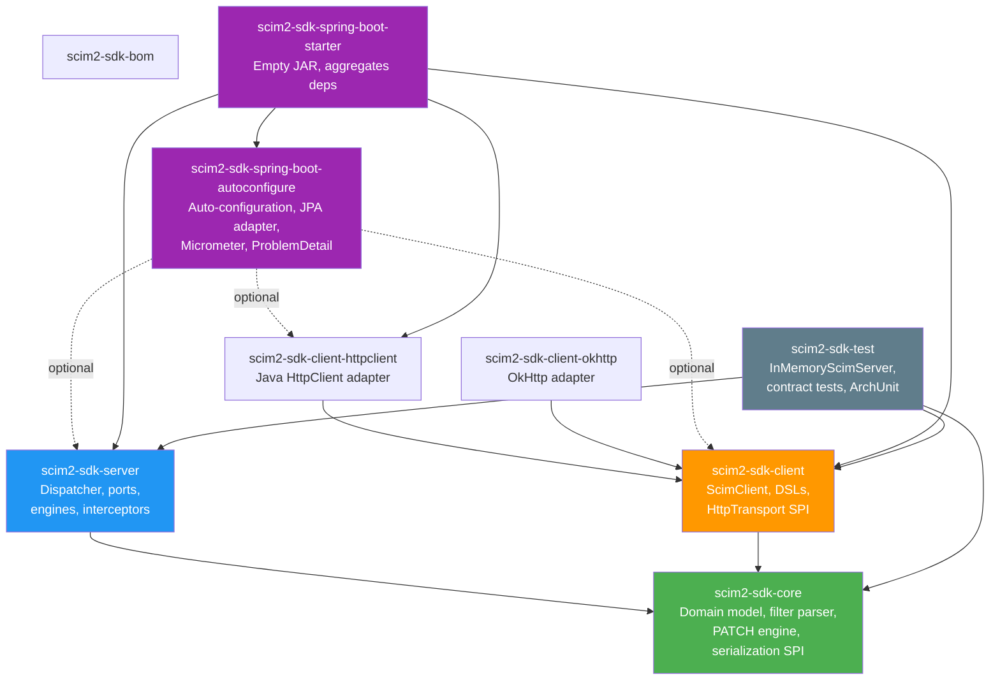
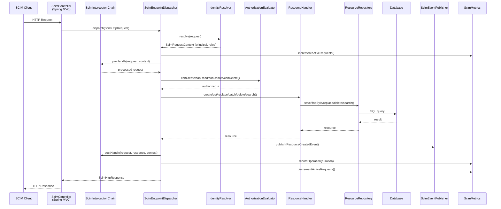
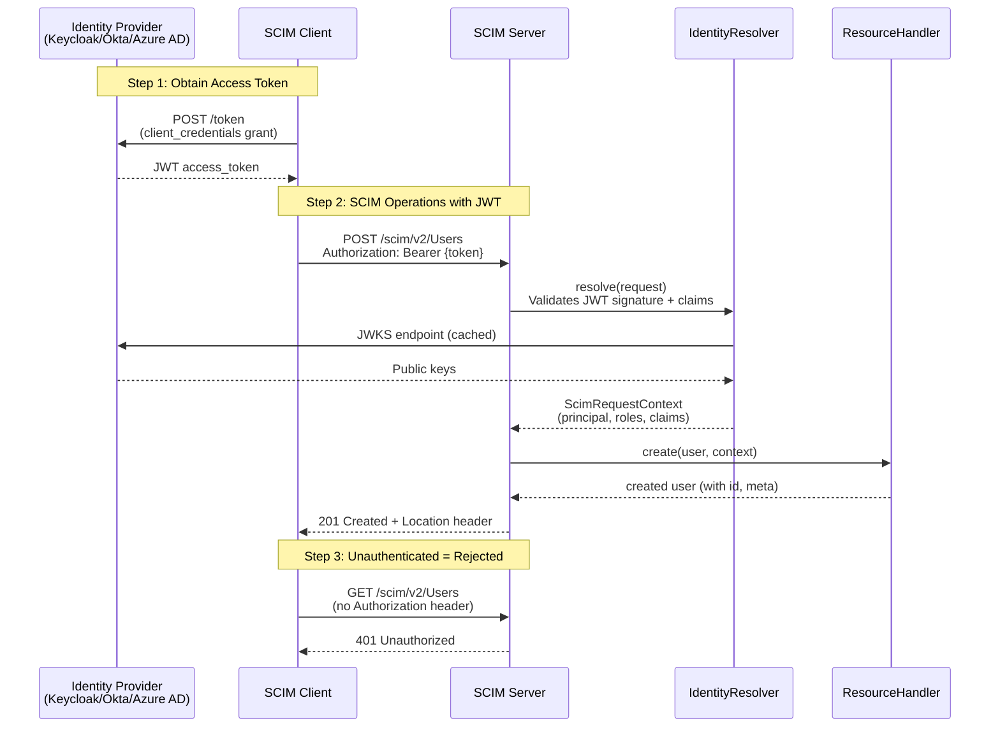
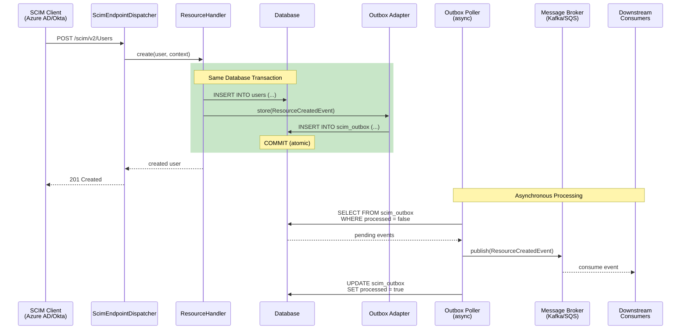
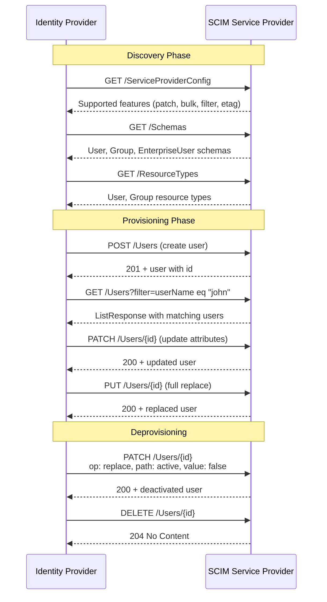
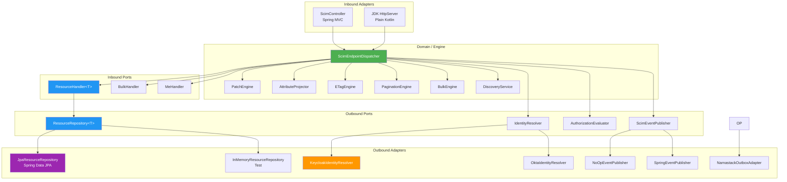

# Architecture

## Module Dependency Graph

## Request Processing Flow

## Authentication with Keycloak (IdP)

## Outbox Pattern for Reliable Event Publishing

## SCIM Provisioning Lifecycle

## Hexagonal Architecture (Server Module)

