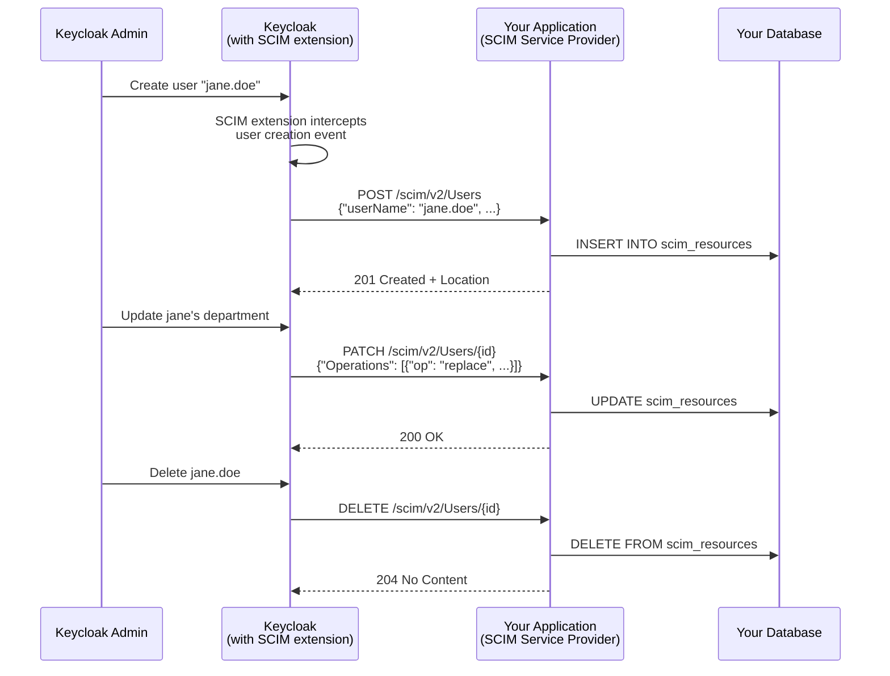

# Keycloak Integration Guide

## Overview

This guide explains how to use the SCIM 2.0 SDK as a Service Provider that receives automated user/group provisioning from Keycloak.



## Prerequisites

1. **Your application** using the SCIM SDK Spring Boot starter
2. **Keycloak** with the [scim-for-keycloak](https://github.com/Captain-P-Goldfish/scim-for-keycloak) extension installed

## Step 1: Configure Your Application

```yaml
scim:
  base-path: /scim/v2
  persistence:
    enabled: true
    auto-migrate: true
  idp:
    provider: keycloak
    client-id: your-keycloak-client
spring:
  security:
    oauth2:
      resourceserver:
        jwt:
          issuer-uri: https://keycloak.example.com/realms/your-realm
```

## Step 2: Install the SCIM Extension in Keycloak

1. Download the [scim-for-keycloak](https://github.com/Captain-P-Goldfish/scim-for-keycloak/releases) JAR
2. Place it in Keycloak's `providers/` directory
3. Restart Keycloak

## Step 3: Configure SCIM in Keycloak

1. Open Keycloak Admin Console
2. Navigate to your realm > SCIM (new menu item from the extension)
3. Configure the SCIM endpoint URL: `https://your-app.example.com/scim/v2`
4. Configure authentication (Bearer token or client credentials)
5. Enable user and group provisioning

## Step 4: Test

1. Create a user in Keycloak
2. Verify the user appears in your application's database
3. Update the user in Keycloak and verify the change propagates
4. Delete the user and verify deletion propagates

## How It Works

The scim-for-keycloak extension registers as a Keycloak Event Listener SPI. When users or groups are created, updated, or deleted in Keycloak, the extension:

1. Intercepts the event
2. Maps the Keycloak user/group to SCIM format
3. Sends the appropriate SCIM operation (POST/PUT/PATCH/DELETE) to your configured endpoint
4. Your application (using this SDK) handles the request and persists the change

This is the same pattern used by Okta, Azure AD, and other IdPs that support SCIM provisioning.

## Keycloak-to-SCIM Attribute Mapping

| Keycloak Attribute | SCIM Attribute           |
|--------------------|--------------------------|
| `username`         | `userName`               |
| `firstName`        | `name.givenName`         |
| `lastName`         | `name.familyName`        |
| `email`            | `emails[type eq "work"]` |
| `enabled`          | `active`                 |
| `id`               | `externalId`             |

## Testing with the SDK

The project includes a simulated Keycloak SCIM provisioning test at
`scim2-sdk-samples/sample-server-spring/src/test/kotlin/.../KeycloakScimProvisioningE2eTest.kt`.

This test:
1. Starts a real Keycloak instance via Testcontainers
2. Creates users in Keycloak via the Admin REST API
3. Simulates the SCIM extension by mapping Keycloak users to SCIM format and POSTing them to the SCIM server
4. Verifies the full lifecycle: create, search, update (PATCH), and delete

To run it locally (requires Docker):

```bash
mvn verify -pl scim2-sdk-samples/sample-server-spring -am
```

## Similar Guides

- [Okta SCIM Integration](https://help.okta.com/en-us/content/topics/apps/apps_app_integration_wizard_scim.htm)
- [Azure AD SCIM Provisioning](https://learn.microsoft.com/en-us/entra/identity/app-provisioning/use-scim-to-provision-users-and-groups)
