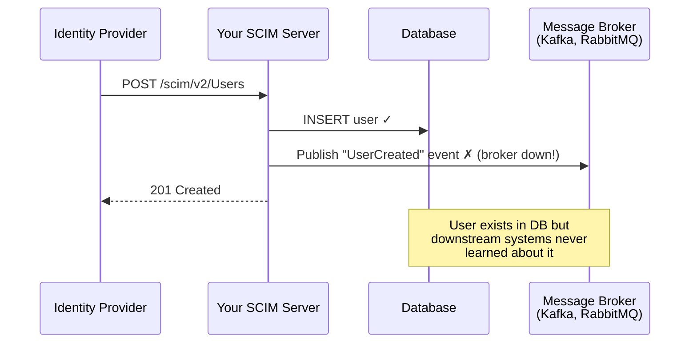
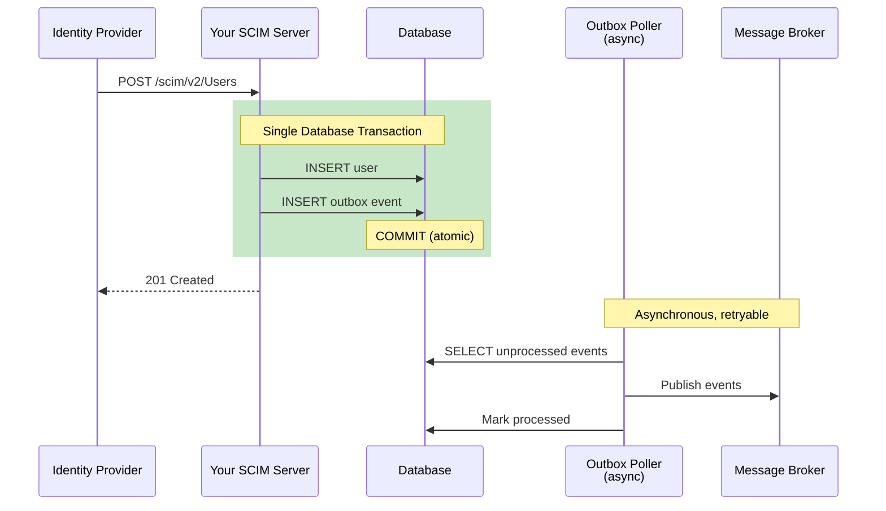
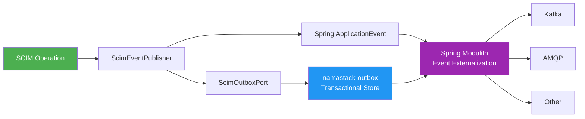
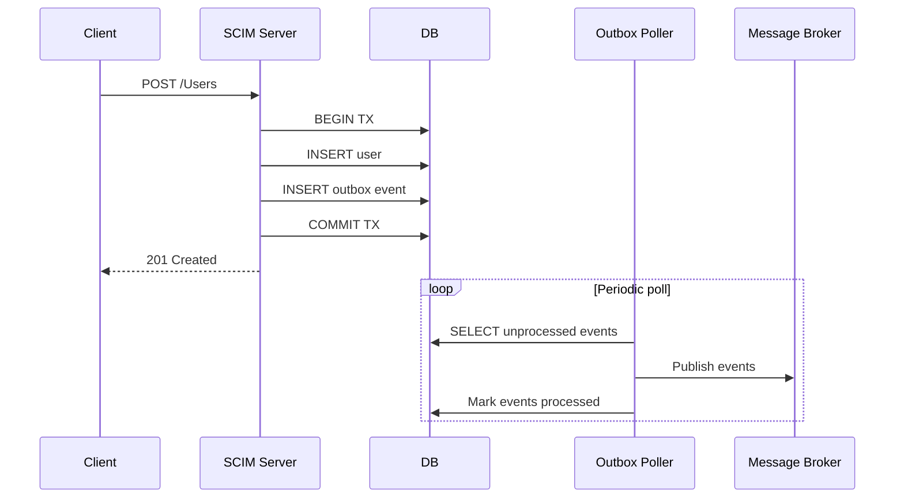
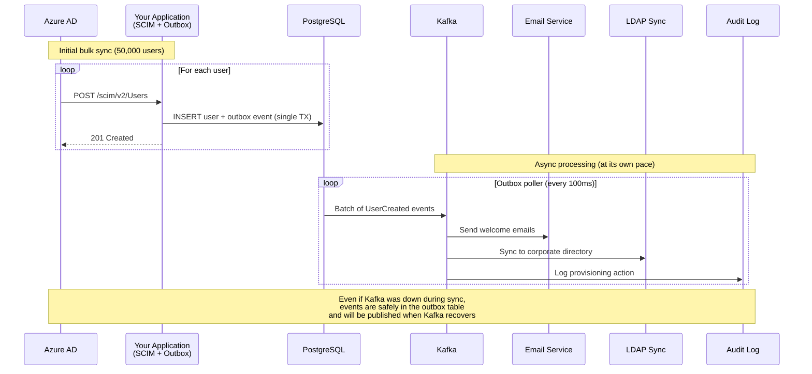

# Outbox Pattern for Reliable Event Publishing

## Why This Matters for SCIM

SCIM provisioning is inherently event-driven: when an Identity Provider like Azure AD, Okta, or Keycloak provisions users to your application, downstream systems often need to react — sending welcome emails, syncing to LDAP, updating access control lists, notifying audit systems, triggering workflows.

### The Problem: Dual-Write Inconsistency

Without the outbox pattern, a typical implementation does this:



This is the **dual-write problem**: your application writes to two systems (database + message broker) without transactional guarantees across them. If the message broker is unavailable — even briefly — events are silently lost. Downstream systems fall out of sync.

In SCIM provisioning, this is especially dangerous because:
- **Azure AD bulk syncs** can push 100,000+ user changes in minutes during initial provisioning or org mergers
- **Okta real-time provisioning** sends individual SCIM operations for every HR change
- **Lost events mean real-world impact**: a new hire doesn't get their email, a terminated employee retains access, group memberships are inconsistent

### The Solution: Transactional Outbox

The outbox pattern eliminates the dual-write by storing events in the **same database transaction** as the resource change:



**Guarantees:**
- **Atomicity**: The event is stored in the same transaction as the resource change. If the DB write fails, no event is created. If the event insert fails, the resource write rolls back.
- **Reliability**: Events are never lost — they persist in the database until successfully published, even across application restarts or broker outages.
- **Ordering**: Events are processed in order (by created_at timestamp).
- **Idempotency**: Each event has a unique `eventId` — downstream consumers can deduplicate.
- **Backpressure**: The poller publishes at its own pace. A flood of SCIM operations doesn't overwhelm the message broker.

### When You DON'T Need the Outbox

The outbox pattern adds complexity. You don't need it if:
- Your application has no downstream event consumers
- Fire-and-forget events are acceptable (use Spring `ApplicationEvent` instead — see Option 3 below)
- Your SCIM server is a simple CRUD app with no async workflows
- You're in early development and can accept occasional event loss

The SDK defaults to **no outbox** (`NoOpEventPublisher`). You opt in only when you need reliable event publishing.

### How It Relates to Spring Modulith

[Spring Modulith](https://spring.io/projects/spring-modulith) promotes event-driven communication between application modules. The outbox pattern aligns directly:

- `ScimEvent` instances can be published as Spring `ApplicationEvent`s
- Spring Modulith's [Event Externalization](https://docs.spring.io/spring-modulith/reference/events.html#externalization) can forward them to Kafka, AMQP, etc.
- [namastack-outbox](https://github.com/namastack/namastack-outbox) provides the transactional outbox infrastructure that Spring Modulith uses



## How It Works



## Using the ScimOutboxPort

The `ScimOutboxPort` interface in the server module defines the outbox contract:

```kotlin
interface ScimOutboxPort {
    fun store(event: ScimEvent)
}
```

### Option 1: namastack-outbox (Recommended)

[namastack-outbox](https://github.com/namastack/namastack-outbox) provides transactional outbox support and is available in Maven Central. It integrates with Spring Modulith's event externalization, meaning events stored via the outbox can be automatically forwarded to Kafka, AMQP, or any other supported broker through Spring Modulith's `EventExternalizationConfiguration`.

Add the dependency:

```xml
<dependency>
    <groupId>com.namastack</groupId>
    <artifactId>namastack-outbox-spring-boot-starter</artifactId>
    <version>${namastack-outbox.version}</version>
</dependency>
```

Configure in `application.yml`:

```yaml
scim:
  outbox:
    enabled: true
```

The SDK auto-configures a `NamastackOutboxAdapter` implementing `ScimOutboxPort` that delegates to namastack-outbox's event publishing. Events are stored transactionally alongside your resource changes and published asynchronously.

### Option 2: Custom Implementation

Implement `ScimOutboxPort` and register as a Spring bean.

**Kotlin:**

```kotlin
@Component
class MyOutboxPort(private val jdbcTemplate: JdbcTemplate) : ScimOutboxPort {
    override fun store(event: ScimEvent) {
        jdbcTemplate.update(
            "INSERT INTO my_outbox (event_id, event_type, payload, created_at) VALUES (?, ?, ?, ?)",
            event.eventId, event::class.simpleName, objectMapper.writeValueAsString(event), event.timestamp
        )
    }
}
```

**Java:**

```java
@Component
public class MyOutboxPort implements ScimOutboxPort {
    private final JdbcTemplate jdbcTemplate;
    private final ObjectMapper objectMapper;

    public MyOutboxPort(JdbcTemplate jdbcTemplate, ObjectMapper objectMapper) {
        this.jdbcTemplate = jdbcTemplate;
        this.objectMapper = objectMapper;
    }

    @Override
    public void store(ScimEvent event) {
        jdbcTemplate.update(
            "INSERT INTO my_outbox (event_id, event_type, payload, created_at) VALUES (?, ?, ?, ?)",
            event.getEventId(),
            event.getClass().getSimpleName(),
            objectMapper.writeValueAsString(event),
            event.getTimestamp()
        );
    }
}
```

### Option 3: Spring Application Events (No Outbox)

By default, the SDK publishes `ScimEvent` instances via `ScimEventPublisher`. In Spring, these become `ApplicationEvent` instances that you can listen to.

**Important:** This approach is **fire-and-forget** with **no delivery guarantees**. If your listener throws an exception, the event is lost. If the application restarts before the listener runs, the event is lost. Use this only when occasional event loss is acceptable.

```kotlin
@Component
class ScimEventListener {
    @EventListener
    fun onResourceCreated(event: ResourceCreatedEvent) {
        // Handle event (non-transactional, fire-and-forget)
    }
}
```

## Database Schema for Outbox

If using a custom outbox implementation, here is a reference schema:

```sql
CREATE TABLE scim_outbox (
    event_id        VARCHAR(255) NOT NULL PRIMARY KEY,
    event_type      VARCHAR(100) NOT NULL,
    resource_type   VARCHAR(100) NOT NULL,
    resource_id     VARCHAR(255) NOT NULL,
    correlation_id  VARCHAR(255),
    payload         TEXT NOT NULL,
    processed       BOOLEAN NOT NULL DEFAULT FALSE,
    created_at      TIMESTAMP NOT NULL DEFAULT CURRENT_TIMESTAMP,
    processed_at    TIMESTAMP
);

CREATE INDEX idx_scim_outbox_unprocessed ON scim_outbox (processed, created_at) WHERE processed = FALSE;
```

## Real-World Example: Azure AD Provisioning with Outbox


