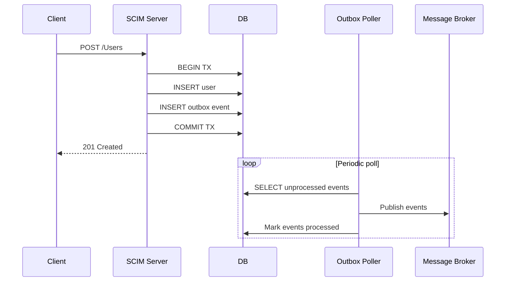

# Outbox Pattern for Reliable Event Publishing

## Overview

SCIM provisioning at scale (e.g., Azure AD syncing 100K+ users) can overwhelm downstream systems. The outbox pattern ensures reliable event publishing by storing events in the same database transaction as the resource change.

## How It Works



## Using the ScimOutboxPort

The `ScimOutboxPort` interface in the server module defines the outbox contract:

```kotlin
interface ScimOutboxPort {
    fun store(event: ScimEvent)
}
```

### Option 1: namastack-outbox (Recommended)

[namastack-outbox](https://github.com/namastack/namastack-outbox) integrates with Spring Modulith for transactional event publishing.

Add the dependency:
```xml
<dependency>
    <groupId>com.namastack</groupId>
    <artifactId>namastack-outbox-spring-boot-starter</artifactId>
    <version>${namastack-outbox.version}</version>
</dependency>
```

Configure:
```yaml
scim:
  outbox:
    enabled: true
```

The SDK auto-configures a `NamastackOutboxAdapter` that implements `ScimOutboxPort` and delegates to namastack-outbox's `OutboxPublisher`.

#### Adapter Code

Since namastack-outbox may not yet be available in Maven Central, you can create the adapter manually in your project:

```kotlin
import com.fasterxml.jackson.databind.ObjectMapper
import com.marcosbarbero.scim2.core.event.ScimEvent
import com.marcosbarbero.scim2.server.port.ScimOutboxPort
// import com.namastack.outbox.OutboxPublisher  // from namastack-outbox
import org.springframework.stereotype.Component

/**
 * Bridges [ScimOutboxPort] to namastack-outbox's [OutboxPublisher].
 *
 * Each [ScimEvent] is mapped to an outbox message with:
 * - aggregateType = "ScimResource"
 * - aggregateId   = event.resourceId
 * - eventType     = event's simple class name (e.g., "ResourceCreatedEvent")
 * - payload       = JSON-serialized event
 *
 * namastack-outbox handles persistence in the same DB transaction and
 * asynchronous relay to the configured message broker (Kafka, SQS, etc.).
 */
@Component
class NamastackOutboxAdapter(
    private val outboxPublisher: Any, // OutboxPublisher — replace with actual type
    private val objectMapper: ObjectMapper
) : ScimOutboxPort {

    override fun store(event: ScimEvent) {
        val payload = objectMapper.writeValueAsString(event)

        // Replace with actual namastack-outbox API call:
        // outboxPublisher.publish(
        //     OutboxMessage(
        //         aggregateType = "ScimResource",
        //         aggregateId = event.resourceId,
        //         eventType = event::class.simpleName ?: "ScimEvent",
        //         payload = payload,
        //         headers = buildMap {
        //             put("correlationId", event.correlationId ?: "")
        //             put("resourceType", event.resourceType)
        //             put("eventId", event.eventId)
        //         }
        //     )
        // )
    }
}
```

Once namastack-outbox is published, replace the commented section with the actual API call and update the `outboxPublisher` type to `OutboxPublisher`.

### Option 2: Custom Implementation

Implement `ScimOutboxPort` and register as a Spring bean:

```kotlin
@Component
class MyOutboxPort(private val jdbcTemplate: JdbcTemplate) : ScimOutboxPort {
    override fun store(event: ScimEvent) {
        jdbcTemplate.update(
            "INSERT INTO my_outbox (event_id, event_type, payload, created_at) VALUES (?, ?, ?, ?)",
            event.eventId, event::class.simpleName, objectMapper.writeValueAsString(event), event.timestamp
        )
    }
}
```

### Option 3: Spring Application Events (No Outbox)

By default, the SDK publishes `ScimEvent` instances via `ScimEventPublisher`. In Spring, these become `ApplicationEvent` instances that you can listen to:

```kotlin
@Component
class ScimEventListener {
    @EventListener
    fun onResourceCreated(event: ResourceCreatedEvent) {
        // Handle event (non-transactional, fire-and-forget)
    }
}
```

## Database Schema for Outbox

If using a custom outbox implementation, here is a reference schema:

```sql
CREATE TABLE scim_outbox (
    event_id        VARCHAR(255) NOT NULL PRIMARY KEY,
    event_type      VARCHAR(100) NOT NULL,
    resource_type   VARCHAR(100) NOT NULL,
    resource_id     VARCHAR(255) NOT NULL,
    correlation_id  VARCHAR(255),
    payload         TEXT NOT NULL,
    processed       BOOLEAN NOT NULL DEFAULT FALSE,
    created_at      TIMESTAMP NOT NULL DEFAULT CURRENT_TIMESTAMP,
    processed_at    TIMESTAMP
);

CREATE INDEX idx_scim_outbox_unprocessed ON scim_outbox (processed, created_at) WHERE processed = FALSE;
```
