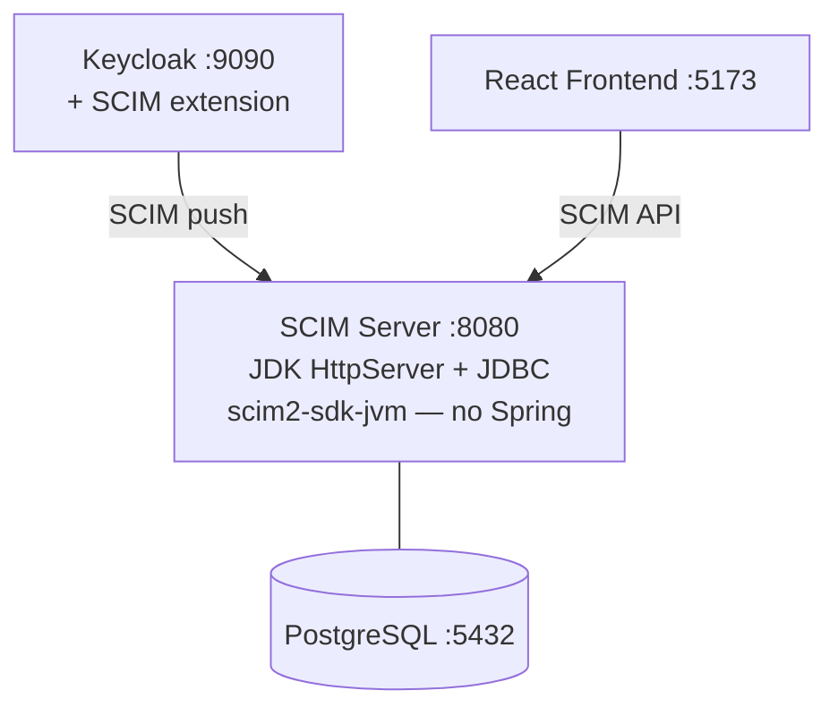

# SCIM Full-Stack Sample (Plain Java)

A production-like SCIM 2.0 application using only the JDK HTTP server — **no Spring Boot**.
Demonstrates that scim2-sdk-jvm works without any framework.

- **Backend**: JDK HttpServer + [scim2-sdk-jvm](https://github.com/marcosbarbero/scim2-sdk-jvm) + PostgreSQL (plain JDBC)
- **Frontend**: React 19 + keycloak-js (shared with Spring sample)
- **Keycloak**: Identity provider with [keycloak-scim2-storage](https://github.com/suvera/keycloak-scim2-storage) for SCIM provisioning

## Architecture



## Quick Start

```bash
docker compose up -d
```

Wait ~90 seconds for all services to build and start. The SCIM federation in Keycloak is **configured automatically** on startup.

Open **http://localhost:5173** and log in:

| Username | Password | Role        |
|----------|----------|-------------|
| admin    | admin    | scim-admin  |
| viewer   | viewer   | scim-reader |

## Testing

### SCIM CRUD via Frontend

1. Open **http://localhost:5173**
2. Create, update, delete users and groups via the UI
3. Verify via the SCIM API:
   ```bash
   curl -s http://localhost:8080/scim/v2/Users | python3 -m json.tool
   curl -s http://localhost:8080/scim/v2/Groups | python3 -m json.tool
   ```

### Inbound: Keycloak -> SCIM Server

1. Open the Keycloak Admin Console at **http://localhost:9090** (admin/admin)
2. Switch to the **scim-sample** realm
3. Go to **Users** -> **Add user** -> create a user
4. Within ~60 seconds, the user appears in:
   - The React frontend at **http://localhost:5173**
   - The SCIM server: `curl -s http://localhost:8080/scim/v2/Users | python3 -m json.tool`

### SCIM API (curl)

```bash
# Service provider config
curl -s http://localhost:8080/scim/v2/ServiceProviderConfig | python3 -m json.tool

# Create a user
curl -s -X POST http://localhost:8080/scim/v2/Users \
  -H "Content-Type: application/scim+json" \
  -d '{"schemas":["urn:ietf:params:scim:schemas:core:2.0:User"],"userName":"jane","emails":[{"value":"jane@example.com","primary":true}]}' \
  | python3 -m json.tool

# List users
curl -s http://localhost:8080/scim/v2/Users | python3 -m json.tool

# Update a user (replace {id} with actual ID)
curl -s -X PUT http://localhost:8080/scim/v2/Users/{id} \
  -H "Content-Type: application/scim+json" \
  -d '{"schemas":["urn:ietf:params:scim:schemas:core:2.0:User"],"userName":"jane","displayName":"Jane Doe"}' \
  | python3 -m json.tool

# Delete a user
curl -s -X DELETE http://localhost:8080/scim/v2/Users/{id}

# Create a group
curl -s -X POST http://localhost:8080/scim/v2/Groups \
  -H "Content-Type: application/scim+json" \
  -d '{"schemas":["urn:ietf:params:scim:schemas:core:2.0:Group"],"displayName":"Engineering"}' \
  | python3 -m json.tool

# Discovery endpoints
curl -s http://localhost:8080/scim/v2/Schemas | python3 -m json.tool
curl -s http://localhost:8080/scim/v2/ResourceTypes | python3 -m json.tool
```

## Key Differences from the Spring Boot Sample

| Aspect              | Spring Boot Sample                    | This Sample                    |
|---------------------|---------------------------------------|--------------------------------|
| HTTP server         | Spring MVC (Tomcat)                   | JDK HttpServer + virtual threads |
| Persistence         | Spring Data JPA + Flyway              | Plain JDBC + auto-init schema  |
| Auth                | Spring Security + OAuth2 JWT          | No authentication              |
| Outbound provisioning | Yes (ScimOutboundProvisioningListener) | No (no Spring event system) |
| Configuration       | application.yml + auto-config         | Environment variables          |
| Dependencies        | ~20 transitive JARs                   | SDK + JDBC driver + SLF4J      |
| Framework           | Spring Boot 4.x                       | None                           |

## Known Limitations

### No Outbound Provisioning

The plain server has no Spring event system, so changes are not automatically pushed to another SCIM server. Use the [Spring Boot sample](../sample-fullstack-spring/) for bidirectional sync with a target server.

### No Authentication

The plain server doesn't validate JWT tokens. All SCIM requests are accepted without authentication. In production, you would add JWT validation or another auth mechanism.

### Keycloak SCIM Extension (suvera/keycloak-scim2-storage)

The [suvera/keycloak-scim2-storage](https://github.com/suvera/keycloak-scim2-storage) extension only supports **user creation**:

| Keycloak Operation | Propagates? |
|---|---|
| Create user | Yes |
| Update user | **No** |
| Delete user | **No** |
| Groups | **No** |

These are limitations of the suvera extension, not the SDK. All SCIM operations work correctly via the frontend and SCIM API.

## Local Development

```bash
# 1. Start PostgreSQL + Keycloak
docker compose up postgres keycloak -d

# 2. Build and run the backend
mvn package -DskipTests -pl :sample-fullstack-plain -am
DATABASE_URL=jdbc:postgresql://localhost:5432/scimdb java -jar scim2-sdk-samples/sample-fullstack-plain/target/sample-fullstack-plain-*.jar

# 3. Start the frontend (from scim2-sdk-samples/)
cd shared-frontend && npm install && VITE_API_MODE=scim npm run dev
```

## Environment Variables

| Variable          | Default                                     | Description            |
|-------------------|---------------------------------------------|------------------------|
| `PORT`            | `8080`                                      | HTTP server port       |
| `DATABASE_URL`    | `jdbc:postgresql://localhost:5432/scimdb`   | PostgreSQL JDBC URL    |
| `DATABASE_USER`   | `scim`                                      | Database username      |
| `DATABASE_PASSWORD` | `scim`                                    | Database password      |

## Services

| Service          | URL                        | Description                    |
|------------------|----------------------------|--------------------------------|
| Frontend         | http://localhost:5173       | React UI (SCIM mode)           |
| Backend          | http://localhost:8080       | SCIM server (JDK + JDBC)      |
| Keycloak         | http://localhost:9090       | Identity provider (admin/admin)|
| PostgreSQL       | localhost:5432              | Database                       |
