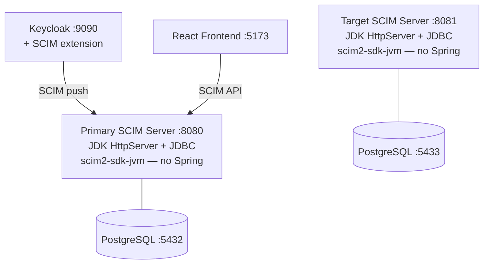

# SCIM Full-Stack Sample (Plain Java)

A production-like SCIM 2.0 application using only the JDK HTTP server — **no Spring Boot**.
Demonstrates that scim2-sdk-jvm works without any framework.

- **Backend**: JDK HttpServer + [scim2-sdk-jvm](https://github.com/marcosbarbero/scim2-sdk-jvm) + PostgreSQL (JDBC)
- **Keycloak**: Identity provider with [keycloak-scim2-storage](https://github.com/suvera/keycloak-scim2-storage) for SCIM provisioning
- **Bidirectional sync**: Two SCIM servers demonstrating inbound and outbound provisioning

## Architecture



## Quick Start

```bash
docker compose up -d
```

Wait ~90 seconds for Keycloak to build and start, then:

1. **Set up SCIM federation** in Keycloak:
   ```bash
   SCIM_ENDPOINT=http://backend:8080/scim/v2 bash docker/setup-scim-federation.sh
   ```

2. **Test SCIM endpoints**:
   ```bash
   # Service provider config
   curl -s http://localhost:8080/scim/v2/ServiceProviderConfig | python3 -m json.tool

   # Create a user
   curl -s -X POST http://localhost:8080/scim/v2/Users \
     -H "Content-Type: application/scim+json" \
     -d '{"schemas":["urn:ietf:params:scim:schemas:core:2.0:User"],"userName":"jane"}' | python3 -m json.tool

   # List users
   curl -s http://localhost:8080/scim/v2/Users | python3 -m json.tool
   ```

3. **Test inbound sync**: Create a user in Keycloak Admin Console (http://localhost:9090, admin/admin, switch to `scim-sample` realm) -> user appears in the SCIM server

## Local Development (no Docker)

```bash
# Start PostgreSQL
docker run -d --name scim-pg -e POSTGRES_DB=scimdb -e POSTGRES_USER=scim -e POSTGRES_PASSWORD=scim -p 5432:5432 postgres:17-alpine

# Build and run
cd backend
mvn package -DskipTests
DATABASE_URL=jdbc:postgresql://localhost:5432/scimdb java -jar target/scim-fullstack-plain-backend-0.0.1-SNAPSHOT.jar
```

Without `DATABASE_URL`, the server falls back to in-memory storage (data lost on restart).

## Key Differences from the Spring Boot Sample

| Aspect         | Spring Boot Sample               | This Sample                    |
|----------------|----------------------------------|--------------------------------|
| HTTP server    | Spring MVC (Tomcat)              | JDK HttpServer                 |
| Persistence    | Spring Data JPA + Flyway         | Plain JDBC + auto-init schema  |
| Auth           | Spring Security + OAuth2         | No authentication              |
| Configuration  | application.yml + auto-config    | Environment variables          |
| Dependencies   | ~20 transitive JARs              | SDK + JDBC driver + SLF4J      |
| Framework      | Spring Boot 4.x                  | None                           |

## Services

| Service          | URL                        | Description                    |
|------------------|----------------------------|--------------------------------|
| Primary Backend  | http://localhost:8080       | SCIM server (JDK + JDBC)      |
| Target Backend   | http://localhost:8081       | Outbound provisioning target   |
| Keycloak         | http://localhost:9090       | Identity provider (admin/admin)|
| PostgreSQL       | localhost:5432              | Primary database               |
| PostgreSQL Target| localhost:5433              | Target database                |
