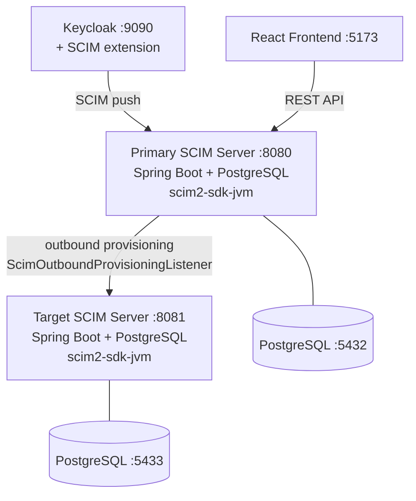

# SCIM Full-Stack Sample (Spring Boot)

A production-like SCIM 2.0 application demonstrating bidirectional identity provisioning:

- **Backend**: Spring Boot 4.x + [scim2-sdk-jvm](https://github.com/marcosbarbero/scim2-sdk-jvm) + PostgreSQL + Flyway
- **Frontend**: React 19 + keycloak-js
- **Keycloak**: Identity provider with [keycloak-scim2-storage](https://github.com/suvera/keycloak-scim2-storage) for SCIM provisioning
- **Bidirectional sync**: Two SCIM servers demonstrating both inbound and outbound provisioning

## Architecture



**Inbound**: Create a user in Keycloak -> automatically appears in the primary SCIM server
**Outbound**: Create a user in the primary SCIM server -> automatically pushed to the target SCIM server

## Quick Start

```bash
docker compose up -d
```

Wait ~60 seconds for all services to start, then:

1. **Set up SCIM federation** in Keycloak:
   ```bash
   SCIM_ENDPOINT=http://backend:8080/scim/v2 bash docker/setup-scim-federation.sh
   ```

2. Open **http://localhost:5173** and log in:

   | Username | Password | Role        |
   |----------|----------|-------------|
   | admin    | admin    | scim-admin  |
   | viewer   | viewer   | scim-reader |

3. **Test inbound sync**: Create a user in Keycloak Admin Console (http://localhost:9090, admin/admin, switch to `scim-sample` realm) -> user appears in the app

4. **Test outbound sync**: The primary SCIM server (`:8080`) pushes to the target (`:8081`):
   ```bash
   # Check target SCIM server
   curl -s http://localhost:8081/scim/v2/Users | python3 -m json.tool
   ```

## Local Development

```bash
# 1. Start infrastructure
docker compose up postgres postgres-target keycloak -d

# 2. Start backend
cd backend && mvn spring-boot:run

# 3. Start frontend
cd frontend && npm install && npm run dev

# 4. Set up SCIM federation
SCIM_ENDPOINT=http://host.docker.internal:8080/scim/v2 bash docker/setup-scim-federation.sh
```

## Services

| Service          | URL                        | Description                    |
|------------------|----------------------------|--------------------------------|
| Frontend         | http://localhost:5173       | React UI                       |
| Primary Backend  | http://localhost:8080       | SCIM server + REST API         |
| Target Backend   | http://localhost:8081       | Outbound provisioning target   |
| Keycloak         | http://localhost:9090       | Identity provider (admin/admin)|
| PostgreSQL       | localhost:5432              | Primary database               |
| PostgreSQL Target| localhost:5433              | Target database                |
