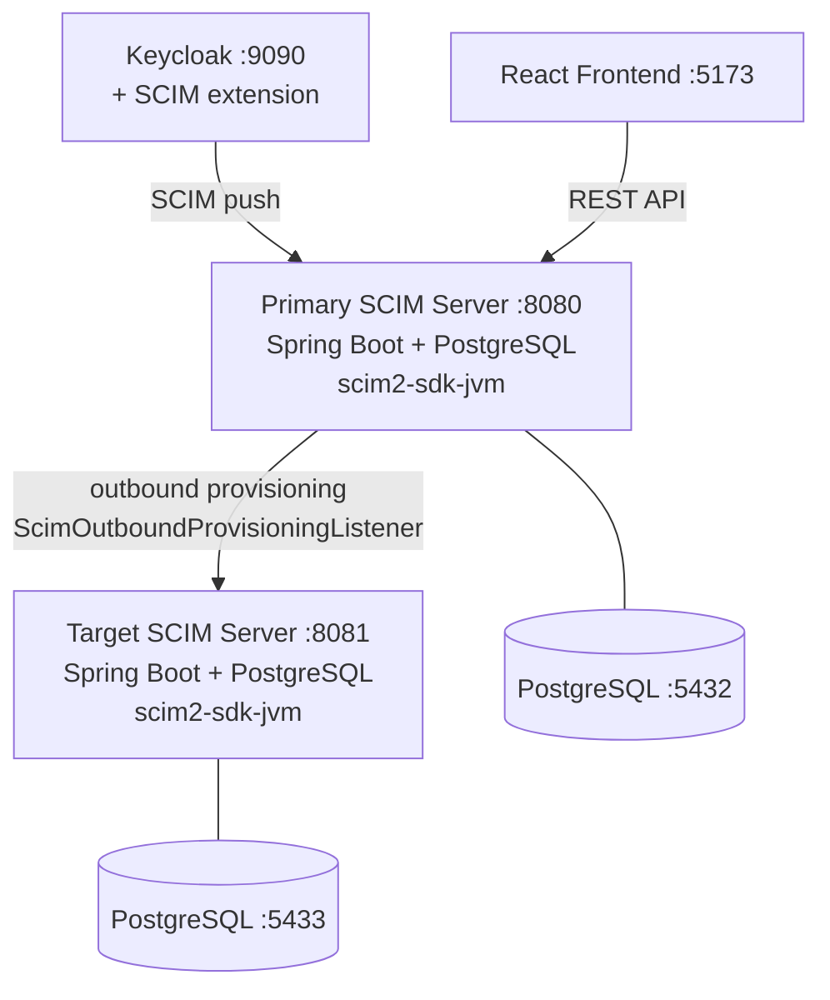

# SCIM Full-Stack Sample (Spring Boot)

A production-like SCIM 2.0 application demonstrating bidirectional identity provisioning:

- **Backend**: Spring Boot 4.x + [scim2-sdk-jvm](https://github.com/marcosbarbero/scim2-sdk-jvm) + PostgreSQL + Flyway
- **Frontend**: React 19 + keycloak-js
- **Keycloak**: Identity provider with [keycloak-scim2-storage](https://github.com/suvera/keycloak-scim2-storage) for SCIM provisioning
- **Bidirectional sync**: Two SCIM servers demonstrating both inbound and outbound provisioning

## Architecture



## Quick Start

```bash
docker compose up -d
```

Wait ~90 seconds for all services to build and start. The SCIM federation in Keycloak is **configured automatically** on startup.

Open **http://localhost:5173** and log in:

| Username | Password | Role        |
|----------|----------|-------------|
| admin    | admin    | scim-admin  |
| viewer   | viewer   | scim-reader |

## Testing Bidirectional Sync

### Inbound: Keycloak -> SCIM Server

1. Open the Keycloak Admin Console at **http://localhost:9090** (admin/admin)
2. Switch to the **scim-sample** realm
3. Go to **Users** -> **Add user** -> create a user
4. Within ~15 seconds, the user appears in:
   - The React frontend at **http://localhost:5173**
   - The primary SCIM server: `curl -s http://localhost:8080/scim/v2/Users | python3 -m json.tool`
   - The target SCIM server: `curl -s http://localhost:8081/scim/v2/Users | python3 -m json.tool`

### Outbound: SCIM Server -> Target Server

1. Create a group in the React frontend at **http://localhost:5173** (Groups tab -> Add Group)
2. The group is pushed to the target SCIM server automatically:
   ```bash
   curl -s http://localhost:8081/scim/v2/Groups | python3 -m json.tool
   ```
3. Users and groups created/updated/deleted via the frontend are provisioned to the target

### Full Round-Trip

```bash
# 1. Check both servers are empty
curl -s http://localhost:8080/scim/v2/Users | python3 -c "import sys,json; print('Primary:', json.load(sys.stdin)['totalResults'])"
curl -s http://localhost:8081/scim/v2/Users | python3 -c "import sys,json; print('Target:', json.load(sys.stdin)['totalResults'])"

# 2. Create a user in Keycloak
TOKEN=$(curl -s -X POST "http://localhost:9090/realms/master/protocol/openid-connect/token" \
  -d "grant_type=password&client_id=admin-cli&username=admin&password=admin" \
  | python3 -c "import sys,json; print(json.load(sys.stdin)['access_token'])")

curl -s -X POST -H "Authorization: Bearer $TOKEN" -H "Content-Type: application/json" \
  "http://localhost:9090/admin/realms/scim-sample/users" \
  -d '{"username":"round.trip.test","email":"rt@test.com","firstName":"Round","lastName":"Trip","enabled":true}'

# 3. Wait for sync and verify both servers
sleep 15
curl -s http://localhost:8080/scim/v2/Users | python3 -c "import sys,json; [print(f'  Primary: {r[\"userName\"]}') for r in json.load(sys.stdin).get('Resources',[])]"
curl -s http://localhost:8081/scim/v2/Users | python3 -c "import sys,json; [print(f'  Target: {r[\"userName\"]}') for r in json.load(sys.stdin).get('Resources',[])]"
```

## Observability

The sample includes an optional observability stack (Prometheus + Grafana) for monitoring SCIM operations.

### Start with observability

```bash
docker compose --profile observability up -d
```

This starts all services plus:
- **Prometheus** at http://localhost:9091 -- scrapes `/actuator/prometheus` from both SCIM servers
- **Grafana** at http://localhost:3000 (login: admin / admin) -- pre-built SCIM dashboard

### SCIM Dashboard

Open Grafana and navigate to **Dashboards > SCIM Overview**. The dashboard includes:

1. **Request Rate by Endpoint** -- requests per second broken down by endpoint, method, and status
2. **Request Latency p95** -- 95th percentile latency for each endpoint
3. **Active Requests** -- current in-flight SCIM requests
4. **Error Rate** -- rate of 4xx/5xx responses

### Metrics Exposed

The SCIM SDK automatically registers the following metrics when Micrometer is on the classpath:

| Metric | Type | Tags |
|---|---|---|
| `scim.request.duration` | Timer | endpoint, method, status |
| `scim.request.active` | Gauge | endpoint |
| `scim.filter.parse.duration` | Timer | success |
| `scim.patch.duration` | Timer | endpoint |
| `scim.bulk.duration` | Timer | -- |
| `scim.search.duration` | Timer | endpoint |

## Known Limitations

### Keycloak SCIM Extension (suvera/keycloak-scim2-storage)

The [suvera/keycloak-scim2-storage](https://github.com/suvera/keycloak-scim2-storage) extension only supports **user creation**. The following operations in Keycloak do **not** propagate to the SCIM server:

| Operation | Propagates? | Notes |
|---|---|---|
| Create user | Yes | Syncs within ~60 seconds |
| Update user | **No** | Extension doesn't queue `userUpdate` actions |
| Delete user | **No** | Extension doesn't queue `userDelete` actions |
| Create group | **No** | Extension doesn't support group sync |

These are limitations of the suvera extension, not the SDK. All SCIM operations work correctly when called directly via the SCIM protocol or the React frontend:

| Operation via Frontend/SCIM API | Propagates to target? |
|---|---|
| Create user | Yes |
| Update user | Yes |
| Delete user | Yes |
| Create/update/delete group | Yes |

For full bidirectional sync with Keycloak, consider using a SCIM extension that supports all operations (e.g., the commercial [scim-for-keycloak](https://scim-for-keycloak.de/) or [mitodl/keycloak-scim](https://github.com/mitodl/keycloak-scim)).

## Local Development

```bash
# 1. Start infrastructure
docker compose up postgres postgres-target keycloak scim-federation-setup -d

# 2. Start backend
mvn spring-boot:run

# 3. Start frontend (from repo root)
cd ../shared-frontend && npm install && npm run dev
```

## Services

| Service          | URL                        | Description                    |
|------------------|----------------------------|--------------------------------|
| Frontend         | http://localhost:5173       | React UI                       |
| Primary Backend  | http://localhost:8080       | SCIM server + REST API         |
| Target Backend   | http://localhost:8081       | Outbound provisioning target   |
| Keycloak         | http://localhost:9090       | Identity provider (admin/admin)|
| PostgreSQL       | localhost:5432              | Primary database               |
| PostgreSQL Target| localhost:5433              | Target database                |
