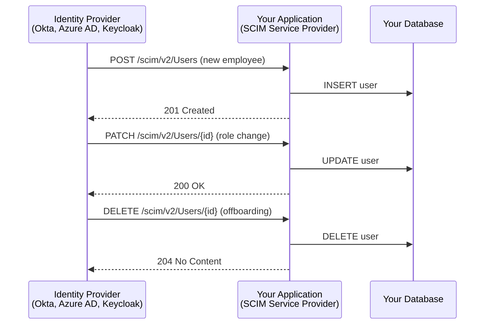
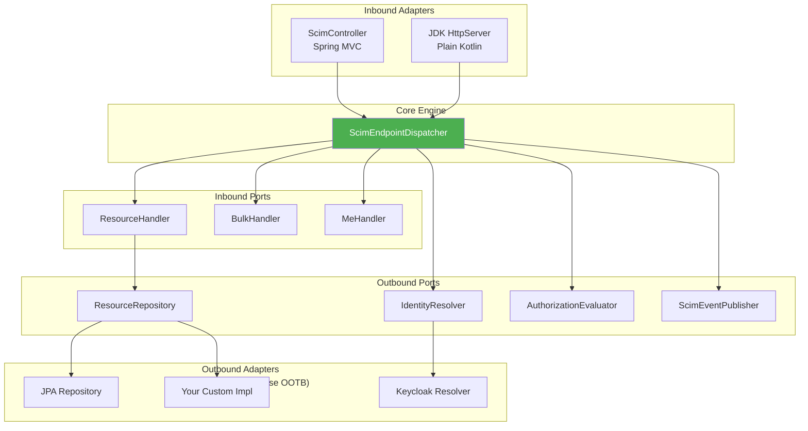

# SCIM 2.0 SDK :: Server

This module provides the **SCIM Service Provider** framework -- the server-side implementation that receives and processes identity provisioning requests from Identity Providers (IdPs).

## What is a SCIM Service Provider?

When organizations use IdPs like **Okta**, **Azure AD**, **Keycloak**, or **PingFederate**, those IdPs need to push user/group changes to your application. The SCIM 2.0 protocol (RFC 7644) standardizes this:



For example, when a new employee joins and is added in Okta, Okta sends a `POST /scim/v2/Users` request to your application. This module handles that request.

See: [Okta SCIM Integration Guide](https://help.okta.com/en-us/content/topics/apps/apps_app_integration_wizard_scim.htm)

## Architecture (Hexagonal)



## Key Interfaces

### ResourceHandler<T> (you implement this)
Handles CRUD + search for a specific resource type:

#### Kotlin
```kotlin
class MyUserHandler : ResourceHandler<User> {
    override val resourceType = User::class.java
    override val endpoint = "/Users"
    override fun create(resource: User, context: ScimRequestContext): User { ... }
    override fun get(id: ResourceId, context: ScimRequestContext): User { ... }
    // ... replace, patch, delete, search
}
```

#### Java
```java
public class MyUserHandler implements ResourceHandler<User> {
    @Override public Class<User> getResourceType() { return User.class; }
    @Override public String getEndpoint() { return "/Users"; }
    @Override public User create(User resource, ScimRequestContext context) { ... }
    @Override public User get(ResourceId id, ScimRequestContext context) { ... }
    // ... replace, patch, delete, search
}
```

### ResourceRepository<T> (persistence abstraction)
Generic persistence port -- no database opinion:

#### Kotlin
```kotlin
class MyUserRepository : ResourceRepository<User> {
    override fun create(resource: User): User { ... }
    override fun findById(id: String): User? { ... }
    // ... replace, delete, search
}
```

#### Java
```java
public class MyUserRepository implements ResourceRepository<User> {
    @Override public User create(User resource) { ... }
    @Override public User findById(String id) { ... }
    // ... replace, delete, search
}
```

### IdentityResolver (authentication)
Extracts the authenticated identity from the incoming request:

#### Kotlin
```kotlin
class MyIdentityResolver : IdentityResolver {
    override fun resolve(request: ScimHttpRequest): ScimRequestContext { ... }
}
```

#### Java
```java
public class MyIdentityResolver implements IdentityResolver {
    @Override public ScimRequestContext resolve(ScimHttpRequest request) { ... }
}
```

### ScimEndpointDispatcher
Routes all SCIM HTTP requests to the appropriate handler. Supports all RFC 7644 endpoints:
- `POST /Users`, `GET /Users/{id}`, `PUT`, `PATCH`, `DELETE`
- `GET /Users?filter=...`, `POST /Users/.search`
- `POST /Bulk`
- `GET /ServiceProviderConfig`, `/Schemas`, `/ResourceTypes`
- `GET|PUT|PATCH|DELETE /Me`
- Case-insensitive routing (`/users` = `/Users`)

## Dependencies
- `scim2-sdk-core`
- No Spring, no HTTP framework, no database
